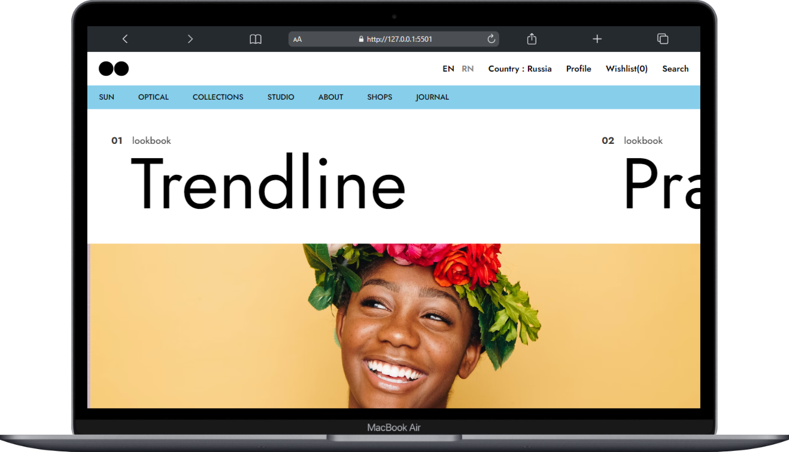
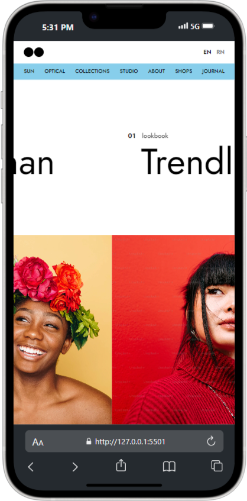

# 🚀 Trendline Landing Page


## 🌟 Introduction
The **Trendline Landing Page** is a clean and modern single-page  website created from a UI image sourced from the internet ,featuring smooth scrolling, elegant typography, and responsive design. Built to showcase a minimal yet interactive user interface, this project utilizes **HTML** ,**CSS**  and **smooth animations** for a delightful user experience.

### Key Purpose:
- A template for landing pages suitable for fashion, portfolios, or business promotions.
- Highlights smooth animations, responsiveness, and sleek navigation.


## ✨ Features

- 📱 **Fully Responsive**: Works seamlessly on mobile, tablet, and desktop devices.
- 🎨 **Modern UI/UX**: Minimal and clean interface with appealing typography.
- 🖼️ **Image Carousel**: Automatic sliding image gallery.
- 💻 **Cross-Browser Compatible**: Works across all major browsers.
- ⚡ **Smooth Animations**: CSS animations for a visually rich experience.
- 🔍 **SEO-Friendly**: Optimized HTML structure.


## 🛠️ Technologies Used

| **Technology**       | **Description**                         |
|-----------------------|-----------------------------------------|
|   | Markup structure                      |
|    | Styling, animations, and responsiveness |
|   | Custom typography (Jost & Kanit)      |
|    | High-quality stock images             |


## 🚀 Getting Started

### Prerequisites
Ensure you have the following installed:
- A modern browser (e.g., Chrome, Firefox, Edge).
- Basic understanding of HTML and CSS (optional).

### Installation
Follow these steps to get the project running:

```bash
# Clone the repository
git clone https://github.com/yourusername/trendline-landing-page.git

# Navigate to the project folder
cd trendline-landing-page

# Open the HTML file in your browser
open index.html
```

Alternatively, you can directly run it via **Live Server** in VSCode.


## 🧭 Usage

- **Navigation Bar**: Provides access to various sections (**SUN**, **OPTICAL**, **COLLECTIONS**, etc.).
- **Content Scroller**: Horizontal scroll for headings with synchronized images.
- **Image Carousel**: Automatically cycles through the image gallery with smooth animations.


## 📁 Code Overview

### Project Structure:
```plaintext
trendline-landing-page/
├── index.html          # Main HTML file
├── style.css           # Core stylesheet for layout and animations
└── assets/             # Images and other assets
```

| File              | Purpose                                |
|-------------------|----------------------------------------|
| `index.html`      | Contains the structure of the webpage. |
| `style.css`       | Handles styles, animations, and layout.|
| `assets/`         | Directory for images and other files.  |


## 🖼️ Example

### Desktop View 💻:
<details>
  <summary>⬇️ Click to view Desktop Version ⬇️</summary>
  <div style="text-align: center; padding: 10px;">
    
  </div>
</details>

### Mobile View 📱:
<details>
  <summary>⬇️ Click to view Mobile Version ⬇️</summary>
  <div style="text-align: center; padding: 10px;">
    
  </div>
</details>


## 🤝 Contributing

Contributions are welcome! 🎉

1. Fork the repository.
2. Create a new branch (`git checkout -b feature/your-feature-name`).
3. Commit your changes (`git commit -m 'Add some feature'`).
4. Push to the branch (`git push origin feature/your-feature-name`).
5. Open a Pull Request.


## 📜 License
This project is licensed under the [**MIT License**.](LICENSE.txt).


## 🙏 Acknowledgements

- ****: For providing high-quality images.
- ****: For beautiful typography.
- **CSS Tricks**: Inspiration for smooth animations.
- All open-source contributors! ❤️


## 🌐 Social

****: Pratham Chauhan.<a href="https://linkedin.com/in/pratham-chauhan-265a8b15a" target="blank"></a>


> Feedback and suggestions are always appreciated. Let’s connect! 🚀


✨ *Thank you for checking out the project!* ✨
